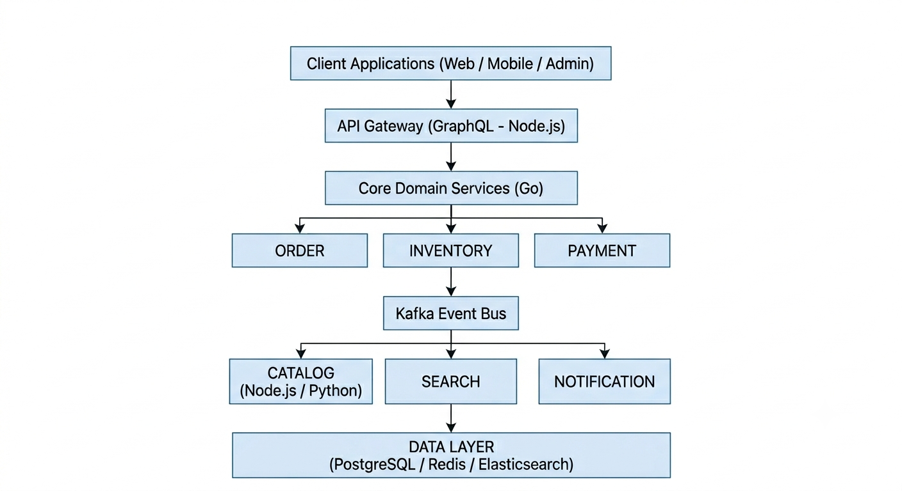

# Ecommerce Platform - Service Overview

This repository provides an overview of the service architecture for the entire ecommerce platform. Each service is deployed in a separate repository. Below, you will find links to each service repository so you can easily navigate to their codebases and documentation.

# High-Level Architecture

  

## Service List and Links

1. [auth-service](https://github.com/mahadiul-hasan/auth-service)
   - Role: Manages user identity and authentication.
   - Responsibilities: User authentication, JWT issuance and validation, role management, vendor/user identity binding.
   - Tech Stack: Go, PostgreSQL, gRPC
   - Rules: Stateless JWT validation, no business logic outside identity.

2. [user-service](https://github.com/mahadiul-hasan/user-service)
   - Role: Manages user profiles and account data.
   - Responsibilities: User profile management, address book, user preferences.
   - Tech Stack: Go, PostgreSQL
   - Rules: No authentication logic (handled by auth-service).

3. [vendor-service](https://github.com/mahadiul-hasan/vendor-service)
   - Role: Manages sellers and shops on the platform.
   - Responsibilities: Vendor onboarding, KYC status, store settings.
   - Tech Stack: Go, PostgreSQL

4. [product-catalog-service](https://github.com/mahadiul-hasan/product-catalog-service)
   - Role: Source of truth for product data.
   - Responsibilities: Product CRUD, categories, attributes, pricing metadata.
   - Tech Stack: Go, PostgreSQL
   - Consistency: Eventually consistent with orders and inventory.

5. [inventory-service](https://github.com/mahadiul-hasan/inventory-service)
   - Role: Prevents overselling and manages stock reservations.
   - Responsibilities: Stock tracking, stock reservation, stock release.
   - Tech Stack: Go, PostgreSQL
   - Rules: Stock is never directly updated; only reserved or released.

6. [order-service](https://github.com/mahadiul-hasan/order-service)
   - Role: Core transaction orchestrator (system of record).
   - Responsibilities: Order lifecycle, saga orchestration, state management.
   - Tech Stack: Go, PostgreSQL
   - Rule: Never synchronously call other services in the business flow.

7. [payment-service](https://github.com/mahadiul-hasan/payment-service)
   - Role: Handles all payment processing.
   - Responsibilities: Payment gateway integration, webhooks, retry logic.
   - Tech Stack: Go, PostgreSQL
   - Rule: All operations must be idempotent.

## Experience Layer Services (Node.js)

8. [api-gateway](https://github.com/mahadiul-hasan/api-gateway)
   - Role: Frontend aggregation layer.
   - Responsibilities: GraphQL API, authentication context injection, request routing.
   - Tech Stack: Node.js, GraphQL, gRPC clients
   - Rule: No business logic allowed.

9. [cart-service](https://github.com/mahadiul-hasan/cart-service)
   - Role: Manages user cart state.
   - Responsibilities: Cart CRUD, temporary storage, fast reads.
   - Tech Stack: Node.js, Redis
   - Rule: Cart is ephemeral and can be rebuilt.

10. [review-service](https://github.com/mahadiul-hasan/review-service)
    - Role: Manages product reviews.
    - Responsibilities: Review creation, ratings, moderation.
    - Tech Stack: Node.js, PostgreSQL

11. [wishlist-service](https://github.com/mahadiul-hasan/wishlist-service)
    - Role: Manages user wishlists.
    - Responsibilities: Wishlist CRUD, item management.
    - Tech Stack: Node.js, PostgreSQL

12. [notification-service](https://github.com/mahadiul-hasan/notification-service)
   - Role: Manages all user notifications.
   - Responsibilities: Email, SMS, push notifications; event-driven messaging.
   - Tech Stack: Node.js, Redis
   - Rule: Asynchronous and retry-enabled; no critical blocking flow.

## Intelligence + Data Layer (Python)

13. [search-service](https://github.com/mahadiul-hasan/search-service)
    - Role: Provides full-text search and ranking.
    - Responsibilities: Indexing products, search query processing, ranking.
    - Tech Stack: Python, Elasticsearch, Kafka
    - Rule: Search is eventually consistent and fully rebuildable.

14. [recommendation-service](https://github.com/mahadiul-hasan/recommendation-service)
    - Role: Generates product recommendations.
    - Responsibilities: ML pipelines, user personalization, product suggestions.
    - Tech Stack: Python, Kafka, ML libraries
    - Rule: Asynchronous processing; ML models continuously updated.

15. [analytics-service](https://github.com/mahadiul-hasan/analytics-service)
    - Role: Provides business intelligence and reporting.
    - Responsibilities: User behavior analytics, sales reports, trend detection.
    - Tech Stack: Python, Kafka, batch processing
    - Rule: Event-driven analytics; eventually consistent.

## Platform Services (Supporting)

16. [audit-log-service](https://github.com/mahadiul-hasan/audit-log-service)
    - Role: Centralized audit log service.
    - Responsibilities: Record all critical system events, user actions.
    - Tech Stack: Node.js, PostgreSQL, Kafka

17. [media-service](https://github.com/mahadiul-hasan/media-service)
    - Role: Handles file and media uploads.
    - Responsibilities: Image and video storage, CDN integration.
    - Tech Stack: Node.js, Object Storage (S3/R2)

## Event Backbone (Conceptual)

- Apache Kafka: Used for all event streaming between services. Events like order creation, payment completion, stock reserved, etc., propagate via Kafka.

---

## How to Use This Repository

1. Each service is in its own repository. Follow the link for each service to access code, documentation, and deployment instructions.
2. For integration, services communicate via gRPC (synchronous) and Kafka (asynchronous events).
3. Use the platform-infrastructure repository for deployment, environment setup, and service orchestration.

If you have any questions or need further guidance, please refer to the individual service documentation or contact the development team.
